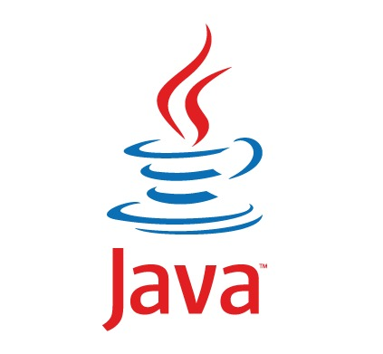

### Hi there, this is Tiago 👋

 
 
I'm a software engineer with solid experience in web development as backend.

I'm a wine lover 🍷, and like to read and code.

**Current stack:**

<code></code>
<code></code>
<code></code>
<code></code>
<code></code>
<code></code>
<code></code>
<code></code>
<code></code>
<code></code>
<code></code>
<code></code>

**Learning:**
 
 
<code></code>
<code></code>